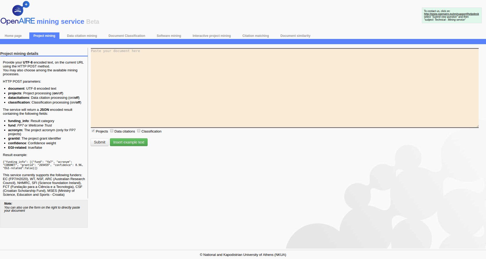

= Extracting project links

[[sect_processing]]

== Extracting project links

The application is currently focussed around this data processing scenario.

The application is implemented as a declarative query on top of madIS (https://github.com/madgik/madis).
The query gets fulltext (in XML format) in its input and produces json in its output.

The following command is running the application:

cat input.xml | python madis/src/mexec.py -f projects.sql -d projects.db > output.json

projects.sql : The declarative query that parses the xmls and extracts the links to projects
projects.db : An SQLite database that stores information about projects that are necessary for the extraction.

There is also a web interface for experimenting at http://mining.openaire.eu/openaireplus/analyze

The user uploads his text and gets the extracted links in JSON format. 
